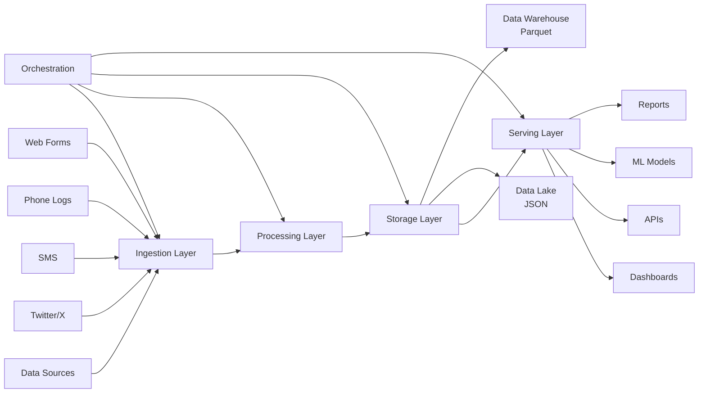

# End-to-End Data Pipeline Blueprint 📊
## Beejan Technologies - Customer Complaint Management System


---

## 📋 Table of Contents

- [Executive Summary](#-executive-summary)
- [Pipeline Architecture](assigment.drawio.png)
- [Source Identification](#1️⃣-source-identification)
- [Ingestion Strategy](#2️⃣-ingestion-strategy)
- [Processing & Transformation](#3️⃣-processing--transformation-layer)
- [Storage Architecture](#4️⃣-storage-architecture)
- [Serving Layer](#5️⃣-serving-layer-architecture)
- [Orchestration & Monitoring](#6️⃣-orchestration--monitoring)
- [DataOps & Deployment](#7️⃣-dataops--production-deployment)
  

---

## 🎯 Executive Summary

This blueprint presents a comprehensive end-to-end data pipeline solution designed to address Beejan Technologies' customer complaint management challenges. The proposed architecture unifies disparate data sources, automates processing workflows, and delivers actionable insights through multiple serving channels, eliminating current data silos and manual reporting bottlenecks.

## 🏗️ Pipeline Architecture



---

## 1️⃣ Source Identification

### 📊 Data Sources & Characteristics
Our pipeline ingests customer complaints from four primary channels:

| Source | Format | Processing Type | Volume/Day | Peak Hours |
|--------|--------|----------------|------------|------------|
| **Twitter/X** | JSON | Real-time Stream | 2,000-3,000 | 24/7 |
| **Web Forms** | JSON/Form Data | Real-time | 1,500-2,000 | 9 AM - 6 PM |
| **SMS** | Text | Hourly Batches | 1,000-1,500 | 9 AM - 8 PM |
| **Phone Logs** | CSV/XML | Daily Batches | 2,000-3,000 | 9 AM - 6 PM |

**🔸 Real-time Streaming Sources:**
- **Twitter/X**: JSON format, continuous stream via Twitter API
- **Web Forms**: JSON/form data, real-time submission capture

**🔹 Batch Processing Sources:**
- **SMS Complaints**: Text messages, processed in hourly batches
- **Phone Call Logs**: Structured CSV/XML files, daily batch processing

### 📈 Volume Assumptions
- Daily complaint volume: 5,000-10,000 across all channels
- Peak hours: 9 AM - 6 PM (business hours)
- Social media: 24/7 activity with sentiment-driven spikes

---

## 2️⃣ Ingestion Strategy

### 🔄 Mixed Ingestion Approach
The architecture employs both streaming and batch ingestion to optimize for each data source's characteristics:

```python
# Conceptual Ingestion Flow
Streaming Sources:
├── Twitter API → Real-time Stream Processing
└── Web Forms → Event-driven Capture

Batch Sources:
├── Phone Logs → Daily Scheduled Jobs
└── SMS Data → Hourly Micro-batches
```

**🚀 Streaming Ingestion:**
- Real-time capture for Twitter and web form data
- Immediate processing capability for urgent complaints
- Event-driven architecture for responsive customer service

**⏰ Batch Ingestion:**
- Scheduled processing for phone logs (daily)
- Micro-batch processing for SMS (hourly)
- Optimized for high-volume, structured data processing

---

## 3️⃣ Processing & Transformation Layer

### ⚙️ Three-Stage Processing Pipeline

```
Raw Data → [Cleaning] → [Validation] → [Enhancement] → Processed Data
```

| Stage | Purpose | Key Activities |
|-------|---------|---------------|
| **🧹 Data Cleaning** | Standardization | Format normalization, duplicate removal, missing data handling |
| **✅ Metadata Validation** | Quality Assurance | Schema validation, business rule checks, anomaly flagging |
| **🎯 Data Enhancement** | Value Addition | Categorization, sentiment analysis, customer enrichment |

**🧹 Data Cleaning:**
- Standardize formats across different sources
- Remove duplicates and invalid entries
- Handle missing data with predefined business rules

**✅ Metadata Validation:**
- Ensure data quality and completeness
- Validate customer IDs and complaint timestamps
- Flag anomalies for manual review

**🎯 Data Enhancement:**
- Categorize complaints into: `Network`, `Billing`, `Customer Service`
- Apply sentiment analysis for priority scoring
- Enrich with customer profile data
- Generate unique complaint IDs for tracking

---

## 4️⃣ Storage Architecture

### 🏗️ Dual-Layer Storage Strategy

```
Data Flow:
Raw Sources → Data Lake (JSON) → Processing → Data Warehouse (Parquet)
```

| Storage Layer | Format | Purpose | Use Cases |
|--------------|--------|---------|-----------|
| **🗂️ Data Lake** | JSON | Raw Data Preservation | Reprocessing, Compliance, Backup |
| **🏪 Data Warehouse** | Parquet | Analytics Optimization | BI Tools, Reports, Dashboards |

**🗂️ Data Lake (Raw Data - JSON Format):**
- ✅ Preserves original complaint data in native format
- ✅ Enables data reprocessing with updated business logic
- ✅ Supports compliance and audit requirements
- ✅ Provides backup for disaster recovery scenarios

**🏪 Data Warehouse (Structured Data - Parquet Format):**
- ⚡ Analytics-optimized columnar storage
- 📦 Compressed, high-performance query capabilities
- 📋 Schema-enforced data for consistent reporting
- 🔗 Optimized for BI tool integration

### 💡 Storage Rationale
This approach balances flexibility (raw data preservation) with performance (structured analytics), following industry best practices for telecom data management.

---

## 5️⃣ Serving Layer Architecture

### 🎯 Multi-Channel Data Delivery

```
Data Warehouse → Multiple Serving Channels → End Users
```

| Channel | Icon | Purpose | Target Users |
|---------|------|---------|--------------|
| **📊 Analytics Dashboards** | 📈 | Real-time monitoring | Management, Operations |
| **🔗 API Endpoints** | 🔌 | System integration | Applications, CRM |
| **🤖 Machine Learning** | 🎯 | Intelligent insights | Data Scientists, Analysts |
| **📋 Report Generation** | 📄 | Business reporting | Executives, Stakeholders |

**📊 Analytics Dashboards:**
- Real-time complaint volume monitoring
- Trend analysis and pattern recognition
- Executive summary views for management decision-making

**🔗 API Endpoints:**
- Integration with existing CRM systems
- Mobile application data feeds
- Third-party system connectivity

**🤖 Machine Learning Integration:**
- Predictive complaint volume forecasting
- Automated priority classification
- Sentiment-based routing algorithms

**📋 Report Generation:**
- Automated daily/weekly/monthly reports
- Ad-hoc query capabilities for business analysts
- Export functionality for offline analysis

---

## 6️⃣ Orchestration & Monitoring

### ⚙️ Pipeline Orchestration Strategy

```
Orchestration Layer Controls:
├── 📅 Scheduling & Dependencies
├── 🔄 Error Handling & Retries  
├── 📊 Monitoring & Alerting
└── 📈 Performance Optimization
```

**📅 Scheduling Framework:**
- Continuous streaming for real-time sources
- Batch scheduling for daily/hourly data processing
- Dependency management between pipeline stages

**🔍 Monitoring & Alerting:**
- Data quality threshold monitoring
- Pipeline failure detection and notification
- Performance metric tracking (processing time, data volume)
- SLA compliance monitoring for complaint response times

**🚨 Error Handling:**
- Automatic retry mechanisms for transient failures
- Dead letter queues for problematic records
- Manual intervention workflows for complex issues

---

## 7️⃣ DataOps & Production Deployment

### 🏗️ Infrastructure Strategy

| Environment | Purpose | Configuration |
|-------------|---------|---------------|
| **🧪 Development** | Testing & Validation | Sandbox with sample data |
| **🔧 Staging** | Pre-production Testing | Full-scale validation |
| **🚀 Production** | Live Operations | Auto-scaling, monitoring |

**☁️ Cloud-First Approach:**
- Scalable infrastructure to handle complaint volume spikes
- Auto-scaling capabilities for processing and storage
- Multi-region deployment for disaster recovery

**🔄 Environment Management:**
- **Development**: Sandbox with sample data for testing
- **Staging**: Full-scale validation with production-like data
- **Production**: Live deployment with monitoring and alerting

**🚀 CI/CD Pipeline:**
- Version-controlled pipeline configurations
- Automated testing for data quality and processing logic
- Gradual rollout capabilities for new features

---

## 📈 Business Impact & Expected Outcomes

### ✅ Immediate Benefits
- **🔗 Unified Data View**: Single source of truth for all customer complaints
- **🤖 Automated Processing**: Elimination of manual data compilation
- **⚡ Real-time Insights**: Faster response to complaint trends and issues

### 🎯 Strategic Advantages
- **📈 Scalability**: Architecture supports business growth and increased complaint volumes
- **📊 Data-Driven Decisions**: Management access to actionable insights and trends
- **⚙️ Operational Efficiency**: Reduced processing time from hours to minutes
- **😊 Customer Satisfaction**: Faster complaint resolution through automated categorization and routing


---

## 🎯 Conclusion

This end-to-end data pipeline blueprint provides **Beejan Technologies** with a robust, scalable solution for customer complaint management. By addressing current data silos, manual processes, and reporting delays, the proposed architecture will transform how the organization handles customer feedback, ultimately leading to improved operational efficiency and customer satisfaction.

### 🎯 Key Achievements
- ✅ **Unified Architecture**: End-to-end data flow from multiple sources
- ✅ **Smart Storage Strategy**: Raw preservation + Analytics optimization  
- ✅ **Scalable Design**: Cloud-first, auto-scaling capabilities
- ✅ **Multi-Channel Serving**: Dashboards, APIs, ML, Reports
- ✅ **Production-Ready**: Monitoring, orchestration, error handling

The conceptual design presented here establishes a solid foundation for implementation, with clear architectural decisions backed by industry best practices and specific business requirements. The pipeline is designed to grow with the organization while maintaining performance, reliability, and data quality standards essential for telecom operations.

## Zain Alvi
 
**Last Updated**: August 2025

---

*This blueprint represents a conceptual design for educational and planning purposes. Implementation details may vary based on specific technical requirements and organizational constraints.*
